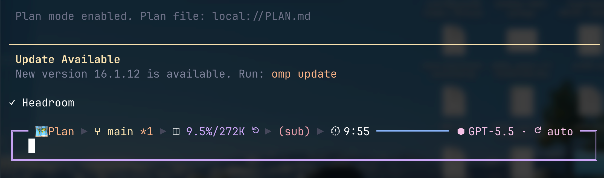

# omp-prompt-border-style



Prompt border styles for the oh-my-pi input editor.

## What this plugin does

This plugin registers a `/prompt-border` command that lets you switch the prompt editor border style and layout at runtime.

It customizes:
- the surrounding top status-line frame glyphs while preserving the upstream status content/context gauge, including its colors and boundary markers
- the editor side borders
- a synthetic bottom border for layouts that use one
- config-driven animated left/right cursor-row glyphs when glyph text is configured
- config-driven status and activity spinner glyphs that preserve Oh My Pi defaults for any unconfigured spinner group
- slash-command argument completions for the command itself
- the plugin-owned Context Rail, which renders independently from OMP's native context gauge
- configurable Context Rail placement (`inside`, `above`, or `below`), visibility mode, pointer, adaptive percentage label, and label position (`left`, `center`, or `right`)
- multiline paste attachment cards above the prompt, alongside the host editor replacement

The default active state is:
- style: `double`
- layout: `full`

## Requirements

- `omp` with plugin support
- `@oh-my-pi/pi-coding-agent` `>=18.0.3`
- `@oh-my-pi/pi-tui` `>=18.0.3`

This package declares the OMP packages as peer dependencies because it extends the host editor UI.

## Install

From a published package name:

```bash
omp plugin install @codesook/omp-prompt-border-style
```

From a local checkout during development:

```bash
omp plugin install "$PWD/packages/prompt-border-style"
```

This repo exposes the extension through `omp.extensions` in `package.json`, pointing at `./src/main.ts`.

## Command

```text
/prompt-border <style> [layout]
/prompt-border layout <layout>
/prompt-border reset
/context-rail [status|on|off|toggle]
/context-rail placement <inside|above|below>
/context-rail visibility <always|toggle|collapse-while-typing>
/context-rail pointer <auto|visible|hidden>
/context-rail labels <auto|bar-only|always>
/context-rail label-glyph <on|off>
/context-rail position <left|center|right>
/prompt-loading-glyphs debug <frames|demo|on|off>
```

If the arguments are invalid, the plugin shows the matching command usage string in the UI.

## Styles

- `round`
- `sharp`
- `heavy`
- `dashed`
- `heavy-dashed`
- `heavy-top`
- `double`
- `double-top`
- `double-side`
- `ascii`
- `block`
- `vertical`
- `double-vertical`
- `horizontal`
- `double-horizontal`

## Layouts

- `full` — full top border, side borders, and a separate synthetic bottom border
- `bottom` — keeps the upstream top/status row and adds only the separate synthetic bottom border
- `sides` — keeps only the left and right editor borders around the body rows
- `top-bottom` — keeps the top border and separate synthetic bottom border, hides side borders in body rows
- `default` — uses the upstream editor layout with the selected surrounding border frame while preserving the upstream status content/context gauge

For non-`default` layouts, the plugin inserts the synthetic bottom border before autocomplete rows so slash-command suggestions stay below the editor body.

## Configuration

The plugin Context Rail is independent from OMP's `statusLine.contextLine` setting. OMP's native gauge may remain enabled, be reduced to its percentage mode, or be disabled separately. The plugin reads context usage through the extension API and degrades to a muted rail when usage is unavailable; predictive compaction markers are only rendered when boundary data is available.

The plugin reads optional settings from `~/.config/codesook-omp/config.json` and writes `style`/`layout` changes there when `/prompt-border` applies a new selection. `/context-rail` updates, including `labelPosition`, are persisted in the same file. That JSON is safe to share across computers.

`style` and `layout` set the initial prompt border, while the `contextRail` settings set the initial rail behavior. The same shared file may also contain a `welcomeScreen` section managed by `codesook-omp`; this plugin preserves that section when it updates `promptBorder`. Local glyph frame text lives next to the JSON in `~/.config/codesook-omp/prompt-border-left-glyphs.txt`, `~/.config/codesook-omp/prompt-border-right-glyphs.txt`, `~/.config/codesook-omp/prompt-border-status-spinner-glyphs.txt`, and `~/.config/codesook-omp/prompt-border-activity-spinner-glyphs.txt`. Frames are whitespace-separated in those text files. Oh My Pi currently has two spinner groups: status and activity. Status frames are used by theme.spinnerFrames/status UI spinners; activity frames are used by getSymbolTheme().spinnerFrames/loading activity…

```json
{
  "promptBorder": {
    "style": "double",
    "layout": "full",
    "leftGlyph": {
      "frameMs": 70
    },
    "rightGlyph": {
      "frameMs": 70
    },
    "spinnerGlyphs": {
      "status": {
        "frameMs": 80
      },
      "activity": {
        "frameMs": 80
      }
    }
  },
  "contextRail": {
    "enabled": true,
    "placement": "inside",
    "visibility": "always",
    "pointer": "auto",
    "labels": "auto",
    "labelPosition": "center",
    "showLabelGlyph": true
  }
}
```

`contextRail.labelPosition` controls where the percentage label is placed on the rail. The accepted values are `left`, `center`, and `right`; `center` is the default and canonical value for the middle position. Marker cells remain protected, so a label may shift or be omitted when it cannot fit safely.

`/context-rail label-glyph off` hides only the label glyph immediately before the percentage. It does not hide the percentage, usage pointer, compaction-boundary markers, or the entire rail. Missing or invalid `contextRail.showLabelGlyph` values default to `true` for backward compatibility.

Context Rail glyph frames are read from `contextRail.glyphDirectory` as `label.txt` and `pointer.txt`. Whitespace separates frames; contiguous glyph characters such as `􂹽􂹾` are one frame and render together. Pointer frames may occupy multiple terminal columns and are kept intact.

`spinnerGlyphs.status.frameMs` and `spinnerGlyphs.activity.frameMs` set the desired source-frame duration in milliseconds for each spinner group.

```text
# ~/.config/codesook-omp/prompt-border-left-glyphs.txt
􁦘􁦙  􁦚􁦛
```

```text
# ~/.config/codesook-omp/prompt-border-right-glyphs.txt

```

```text
# ~/.config/codesook-omp/prompt-border-status-spinner-glyphs.txt
S0  S1  S2
```

```text
# ~/.config/codesook-omp/prompt-border-activity-spinner-glyphs.txt
􁦘􁦙  􁦚􁦛
```

```text
# With activity.frameMs = 240, each activity frame is repeated internally for about 240ms.
# With activity.frameMs = 40, the plugin skips source frames because Oh My Pi cannot repaint the spinner faster than 80ms.
```

Each spinner file may contain one or more whitespace-separated frames. The plugin adapts those configured frames to Oh My Pi's fixed 80ms host spinner tick by repeating frames for slower `frameMs` values and skipping source frames for faster ones. There is no plugin-imposed maximum frame count, but very high `frameMs` values duplicate frames internally, so huge source lists plus slow timings create larger in-memory spinner arrays. If a spinner file is empty or missing, that spinner group is not patched and Oh My Pi uses its built-in frames for that group.

The left and right glyph files affect only the cursor/input row. They do not change border style, layout, side borders, top borders, autocomplete rows, or synthetic bottom borders.

## Debugging loading glyphs

Use the dedicated loading-glyph debug command instead of spending model tokens:

```text
/prompt-loading-glyphs debug frames
/prompt-loading-glyphs debug demo
/prompt-loading-glyphs debug on
/prompt-loading-glyphs debug off
```

`debug frames` prints the source and visible frame sequence for each loading group after `frameMs` adaptation. `debug demo` renders a local no-token preview for every loading group listed by the plugin, currently `status loading` and `activity loading`.
After editing `~/.config/codesook-omp/prompt-border-status-spinner-glyphs.txt`, `~/.config/codesook-omp/prompt-border-activity-spinner-glyphs.txt`, or the matching `spinnerGlyphs.*.frameMs` values in `~/.config/codesook-omp/config.json`, run `/prompt-loading-glyphs debug frames` first and then `/prompt-loading-glyphs debug demo` to verify the actual visible sequence and animation.
For example, with `frameMs = 20` a source list such as `F0 F1 F2 F3 F4 F5 F6 F7` may render as `F0 F4`, so the loop must stay smooth on that visible subsequence rather than only on the full source list.

## Examples

```text
/prompt-border round
/prompt-border heavy
/prompt-border dashed
/prompt-border double bottom
/prompt-border sharp sides
/prompt-border double top-bottom
/prompt-border layout full
/prompt-border layout bottom
/prompt-border layout sides
/prompt-border layout default
/prompt-border reset
/context-rail status
/context-rail label-glyph off
/context-rail placement inside
/context-rail placement below
/context-rail visibility collapse-while-typing
/context-rail pointer hidden
/context-rail position left
/context-rail position center
/context-rail position right
```
## Autocomplete behavior

Typing `/prompt-border ` and then pressing Space or Tab opens command completions.

- First position: all style names, plus `layout` and `reset`
- After a style: all layout names
- After `layout`: all layout names, returned as `layout <name>` completions

## Development

Install dependencies:

```bash
bun install
```

Run the typecheck:

```bash
bun run check
```

```bash
bun test src/context-rail.test.ts src/main.test.ts
```

## Release

From the monorepo root, publish this package with:

```bash
bun run publish:prompt-border-style
```

## Repository contents

- `src/main.ts` — plugin implementation, border rendering, Context Rail, status/activity spinner glyph patching, and command registration
- `src/context-rail.ts` — pure Context Rail config normalization and ANSI-safe renderer
- `src/main.test.ts` — parser, renderer, config, command, and completion tests
- `src/context-rail.test.ts` — Context Rail rendering and edge-state tests
- `package.json` — package metadata, peer dependencies, scripts, and OMP extension entrypoint
- `tsconfig.json` — TypeScript configuration
